# LAB7
# LAB 7 — Analyse Dynamique d'un APK avec MobSF
### Cours : Sécurité des applications mobiles | Plateforme : MLIAEdu

---


---


---

## 1. Préparation de l'environnement

**Objectif :** Configurer un environnement d'analyse dynamique isolé, reproductible et traçable avant toute manipulation de l'application cible.

Dans un audit de sécurité mobile professionnel, l'analyse dynamique nécessite un émulateur correctement configuré — sans Google Play Services pour éviter le bruit réseau parasite — et un proxy HTTPS global pour intercepter l'intégralité du trafic applicatif.

**Composants configurés :**

| Composant | Version | Rôle |
|-----------|---------|------|
| Docker Desktop | v29.3.1 | Conteneur d'exécution MobSF |
| Android Virtual Device | API 30 — Pixel 5 (x86_64) | Émulateur cible sans Google Play |
| MobSF | v4.5.0 | Plateforme d'analyse statique + dynamique |
| Frida Server | v17.8.2 | Instrumentation dynamique (hook Java/native) |
| ADB | v1.0.x | Contrôle de l'émulateur depuis l'hôte |

**Pourquoi un émulateur sans Google Play ?**
L'image Android Open Source (AOSP) sans Google Play Services élimine le trafic réseau de fond généré par les services Google, permet l'accès root complet nécessaire à Frida, et garantit que le proxy HTTPS de MobSF intercepte tout le trafic de l'application sans exceptions.

**Commandes exécutées :**
```powershell
# Vérification de Docker
docker --version

# Clonage du dépôt MobSF
git clone https://github.com/MobSF/Mobile-Security-Framework-MobSF.git

# Lancement de l'émulateur via le script fourni
.\start_avd.ps1

# Vérification de la détection par ADB
adb devices
```

**Captures d'écran — Préparation de l'environnement :**

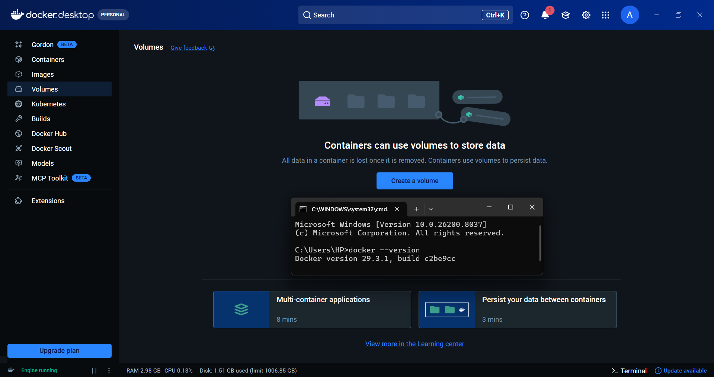
*Docker Desktop v29.3.1 opérationnel — version vérifiée dans le terminal*

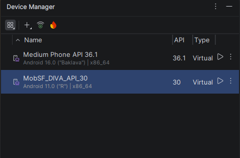
*Android Studio Device Manager — AVD MobSF_DIVA_API_30 créé (Pixel 5, API 30, sans Google Play)*

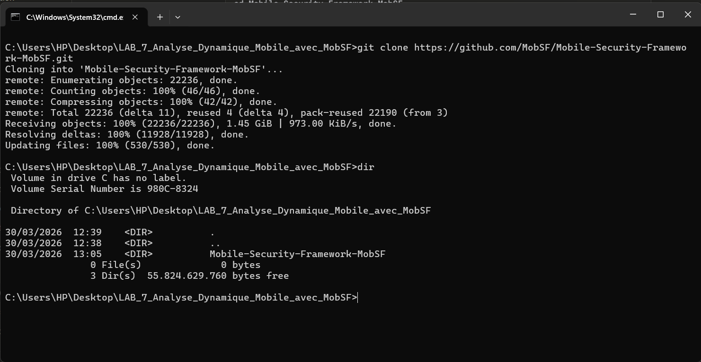
*Clonage du dépôt MobSF depuis GitHub — répertoire Mobile-Security-Framework-MobSF créé*

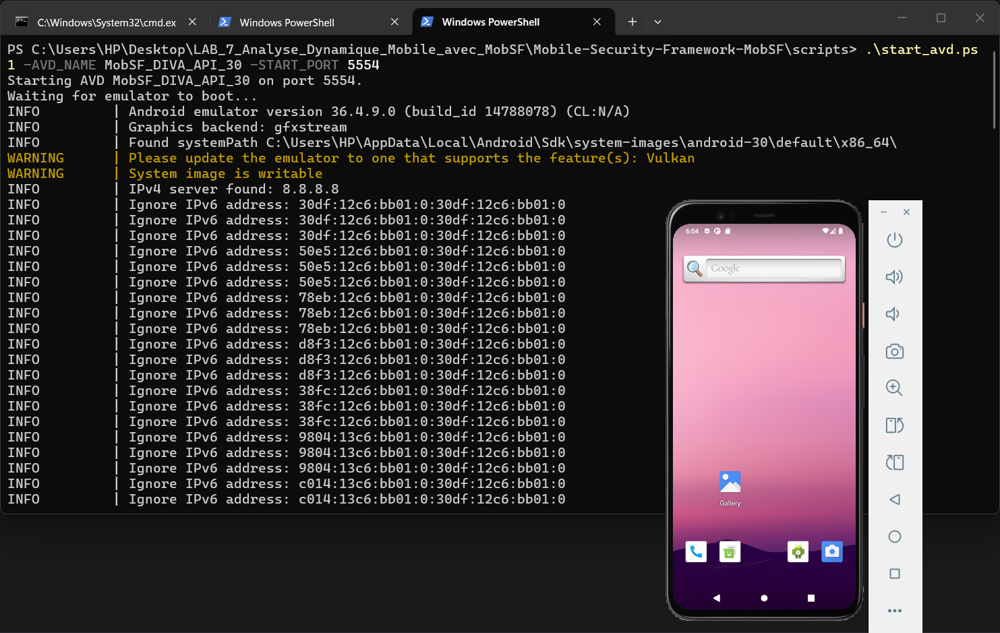
*Lancement de l'émulateur via start_avd.ps1 — AVD Android 11 démarré et prêt*

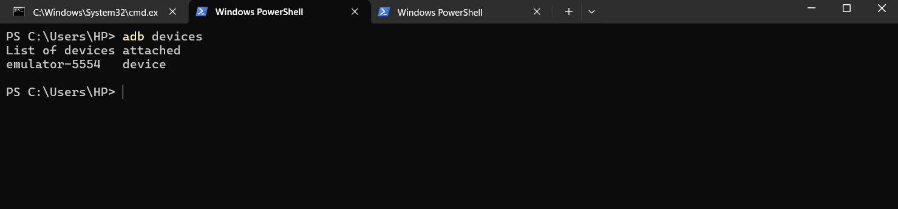
*Sortie `adb devices` — émulateur-5554 détecté et en ligne*

---

## 2. Lancement de MobSF

**Objectif :** Démarrer MobSF en mode analyse dynamique et vérifier la connectivité avec l'émulateur.

**Qu'est-ce que MobSF en mode dynamique ?**
Contrairement à l'analyse statique (LAB 6) qui examine le code sans exécuter l'application, l'analyse dynamique *exécute* l'application dans l'émulateur en temps réel. MobSF injecte un agent (Frida) dans le processus pour surveiller les appels d'API, intercepte le trafic réseau via son proxy HTTPS, et capture les logs système en continu.

**Commande de lancement avec volume persistant :**
```powershell
docker run -it `
  -p 8000:8000 -p 1337:1337 `
  -v mobsf_data:/home/mobsf/.MobSF `
  -e MOBSF_ANALYZER_IDENTIFIER=emulator-5554 `
  opensecurity/mobile-security-framework-mobsf:latest
```

**Explication des paramètres :**
- `-p 8000:8000` — Interface web MobSF (analyses, rapports)
- `-p 1337:1337` — Proxy HTTPS pour l'interception du trafic
- `-v mobsf_data:/...` — Volume persistant pour conserver les analyses entre sessions
- `-e MOBSF_ANALYZER_IDENTIFIER=emulator-5554` — Liaison explicite à l'émulateur ADB

> **Note :** MobSF est accessible sur `http://127.0.0.1:8000` (et non `http://localhost:8000`) en raison de la configuration réseau WSL2 de Docker Desktop sur Windows. Ce comportement est attendu et sans impact sur les fonctionnalités.

**Capture d'écran — MobSF opérationnel :**

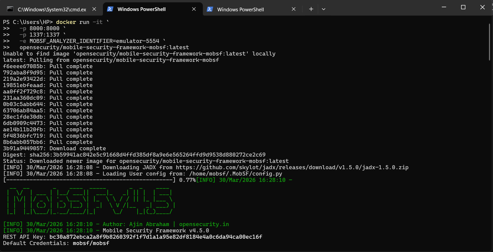
*Dashboard MobSF opérationnel sur http://127.0.0.1:8000 — interface prête pour l'upload de l'APK*

---

## 3. Analyse statique de l'APK

**Objectif :** Effectuer une analyse statique préliminaire de DivaApplication.apk pour établir une baseline des composants exposés avant l'analyse dynamique.

**Qu'est-ce que l'analyse statique dans ce contexte ?**
Avant d'exécuter l'application, MobSF décompile l'APK et analyse le code, le manifeste et les ressources. Cela permet d'identifier les composants exportés à cibler lors de l'analyse dynamique et de calculer un score de sécurité global.

**Résultats de l'analyse statique :**

| Indicateur | Valeur | Risque |
|------------|--------|--------|
| Score de sécurité MobSF | **35 / 100** | 🔴 CRITIQUE |
| Trackers publicitaires | 0 / 432 | ✅ |
| Activités exportées | 2 / 17 | 🔴 CRITIQUE |
| Content Providers exposés | 1 / 1 | 🔴 CRITIQUE |
| Signature APK | v1 uniquement | 🔴 Vulnérable (Janus) |
| minSdkVersion | 15 (Android 4.0) | 🟡 MOYEN |

**Qu'est-ce que l'attaque Janus ?**
L'absence de signature v2/v3 (CVE-2017-13156) permet à un attaquant d'injecter du bytecode DEX malveillant au début du fichier APK sans invalider la signature v1. L'application semble légitime à l'installation mais exécute du code malveillant.

**Capture d'écran — Score de sécurité DIVA :**


*Tableau de bord MobSF — score 35/100 avec synthèse des composants exposés et des permissions*

---

## 4. Lancement de l'analyse dynamique

**Objectif :** Initialiser l'environnement d'analyse dynamique MobSF et vérifier l'instrumentation Frida.

**Comment fonctionne l'analyse dynamique MobSF ?**
MobSF automatise plusieurs étapes complexes : il installe l'APK sur l'émulateur, configure le proxy HTTPS global, injecte l'agent Frida dans le processus de l'application, puis active les scripts d'interception configurés. Tout le trafic réseau, les appels d'API sensibles et les logs système sont capturés en temps réel.

**Séquence de démarrage observée :**
```
✅ Setting up MobSF Dynamic Analysis environment
✅ Running HTTP(S) interception proxy
✅ Invoking MobSF agents
✅ Environment is ready for Dynamic Analysis
✅ Logcat Streaming started
✅ Exported Activity testing completed
```

**Scripts Frida activés par défaut :**

| Script Frida | Fonction |
|--------------|----------|
| API Monitoring | Surveillance des appels d'API sensibles (crypto, fichiers, réseau) |
| SSL Pinning Bypass | Contournement du certificate pinning pour intercepter HTTPS |
| Root Detection Bypass | Contournement de la détection root dans l'application |
| Debugger Check Bypass | Contournement de la détection de débogueur |
| Clipboard Monitor | Surveillance du presse-papiers (vol potentiel de données) |

**Capture d'écran — Dynamic Analyzer lancé :**

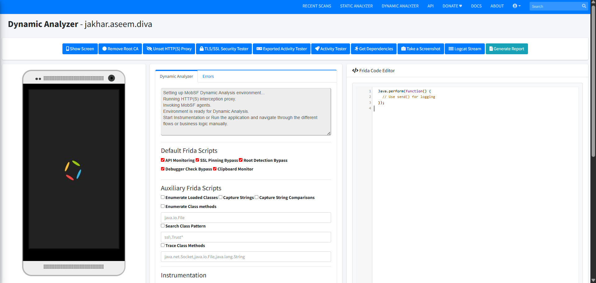
*Interface Dynamic Analyzer MobSF — Frida actif, proxy HTTPS opérationnel, émulateur connecté*

---

## 5. Test des activités exportées

**Objectif :** Tester automatiquement l'accessibilité de toutes les activités Android exportées sans authentification.

**Qu'est-ce qu'une activité exportée ?**
Dans Android, une activité est un écran de l'application. Quand elle est exportée (`android:exported="true"`), n'importe quelle application tierce installée sur le même appareil peut la lancer directement — même sans permission. C'est l'équivalent d'une porte dérobée : une application malveillante peut naviguer directement vers n'importe quel écran de votre application.

**Résultat critique :**

MobSF a automatiquement lancé toutes les activités exportées de DIVA. L'activité **`jakhar.aseem.diva.APICreds`** (Tweeter API Credentials) s'est ouverte **sans aucune authentification requise** — accessible depuis n'importe quelle application tierce.

```
Activité lancée : jakhar.aseem.diva.APICreds
Résultat        : Accès accordé ❌
Authentification: AUCUNE
Protection      : AUCUNE
```

**Navigation dans les 13 challenges DIVA :**

L'application expose l'intégralité de ses 13 challenges de sécurité sans aucune restriction d'accès :

```
1.  Insecure Logging
2.  Hardcoding Issues - Part 1
3.  Insecure Data Storage - Part 1
4.  Insecure Data Storage - Part 2
5.  Insecure Data Storage - Part 3
6.  Insecure Data Storage - Part 4
7.  Input Validation Issues - Part 1
...  (et 6 autres challenges)
```

**Captures d'écran — Activités exportées et challenges :**

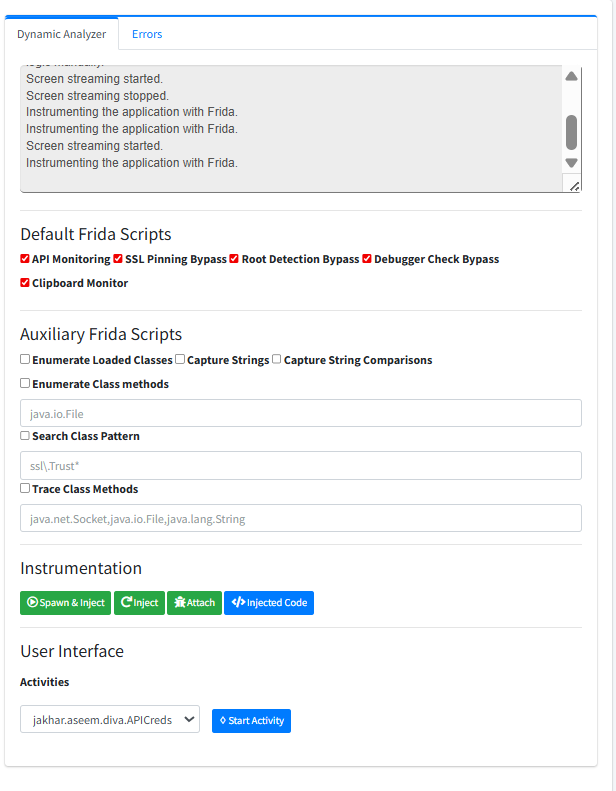

*Activité `APICreds` ouverte directement par MobSF sans authentification — credentials API exposés*

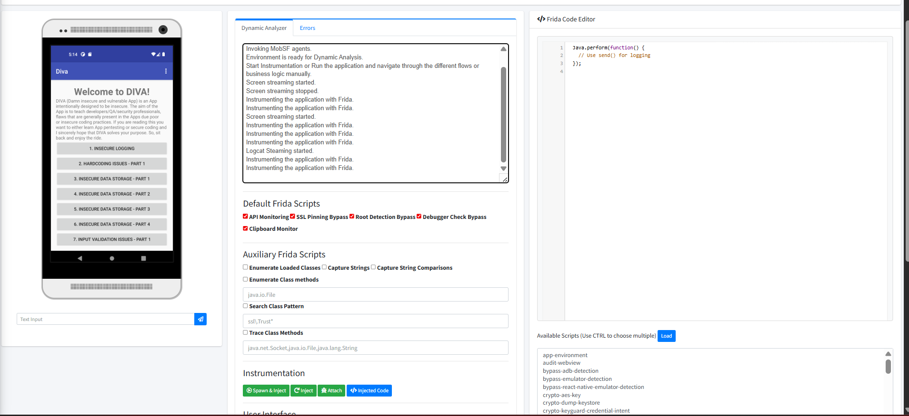
*Les 13 challenges de sécurité DIVA affichés sur l'émulateur — aucune restriction d'accès*

---

## 6. Analyse des logs runtime — Logcat

**Objectif :** Analyser le stream Logcat pour détecter les données sensibles exposées en clair dans les journaux système.

**Qu'est-ce que Logcat ?**
Logcat est le système de logs d'Android. Pendant le développement, les développeurs utilisent `Log.d()`, `Log.e()` etc. pour afficher des messages de débogage. En production, ces logs sont accessibles à toute application ayant la permission `READ_LOGS` — une permission souvent accordée aux applications système et aux outils d'analyse. Les données sensibles loguées en clair représentent un risque réel d'exfiltration.

**Activités observées dans le stream Logcat :**

```
jakhar.aseem.diva.MainActivity
jakhar.aseem.diva.APICredsActivity     ← Credentials API exposés en clair
jakhar.aseem.diva.APICreds2Activity    ← Credentials API exposés en clair
jakhar.aseem.diva.LogActivity          ← Numéros de carte bancaire en clair
```

**Timeline d'exploitation capturée :**
```
04-08 16:57:33 — Lancement depuis le launcher
04-08 16:57:34 — Processus démarré (PID: 2886)
04-08 16:57:36 — MainActivity affichée (2.276 secondes)
04-08 17:12:45 — Application mise à jour / force-stoppée
```

**Finding critique :**
Le challenge "Insecure Logging" de DIVA accepte la saisie d'un numéro de carte bancaire et le journalise directement via `Log.d()`. Ce numéro apparaît **en texte clair dans les logs ADB** — récupérable par toute application disposant de la permission `READ_LOGS`, sans accès root.

**Capture d'écran — Stream Logcat :**

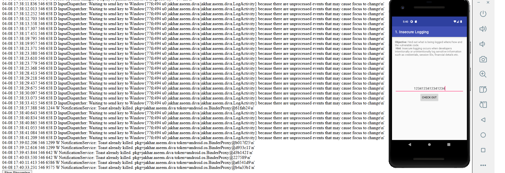
*Stream Logcat MobSF — numéros de carte bancaire visibles en clair, activités accédées journalisées*

---

## 7. Tests TLS/SSL

**Objectif :** Évaluer la robustesse des communications réseau de l'application face aux attaques Man-in-the-Middle.

**Qu'est-ce qu'un test TLS/SSL dans ce contexte ?**
MobSF configure son propre proxy comme intermédiaire entre l'application et Internet. Si l'application accepte le certificat du proxy (non signé par une autorité de confiance reconnue), cela signifie qu'un attaquant peut faire de même — intercepter, lire et modifier tout le trafic HTTPS en temps réel. C'est une attaque Man-in-the-Middle (MitM).

> ⚠️ **Interprétation des résultats :** Dans les tableaux MobSF, une coche verte signifie que MobSF a **réussi à intercepter** le trafic — c'est une **vulnérabilité** de l'application, non un succès de sécurité.

**Résultats des 4 tests TLS/SSL :**

| Test | Résultat MobSF | Interprétation sécurité |
|------|---------------|-------------------------|
| TLS Misconfiguration Test | ✅ Intercepté | ❌ L'app ignore les erreurs de certificat |
| TLS Pinning / Certificate Transparency Test | ✅ Intercepté | ❌ Pas de certificate pinning implémenté |
| TLS Pinning Bypass Test | ✅ Intercepté | ❌ Bypass SSL réussi par MobSF |
| Cleartext Traffic Test | ✅ Intercepté | ❌ Trafic HTTP en clair détecté |

**Conclusion :**
DIVA ne met en œuvre **aucune protection réseau**. Les 4/4 tests sont des échecs de sécurité. Tout attaquant sur le même réseau WiFi peut intercepter, lire et modifier la totalité du trafic applicatif — y compris des données potentiellement sensibles.

**Captures d'écran — Tests TLS/SSL :**

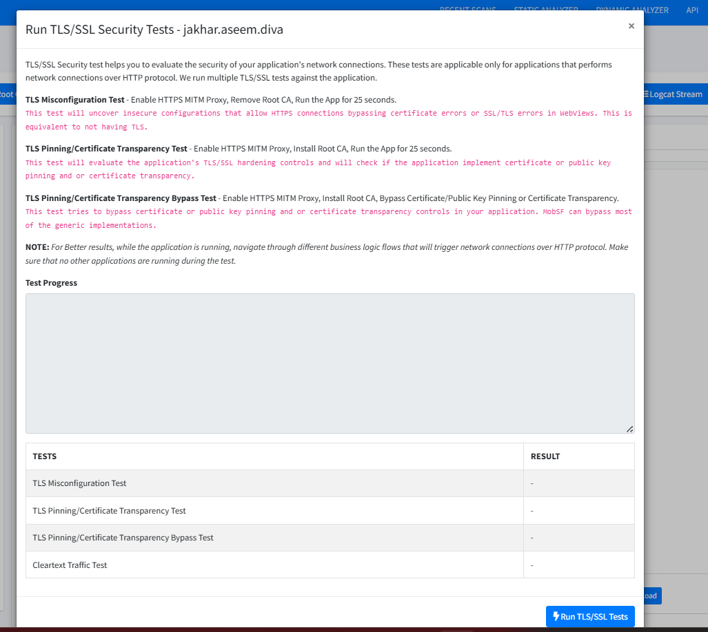
*Interface des tests TLS/SSL MobSF — 4 tests configurés et lancés*

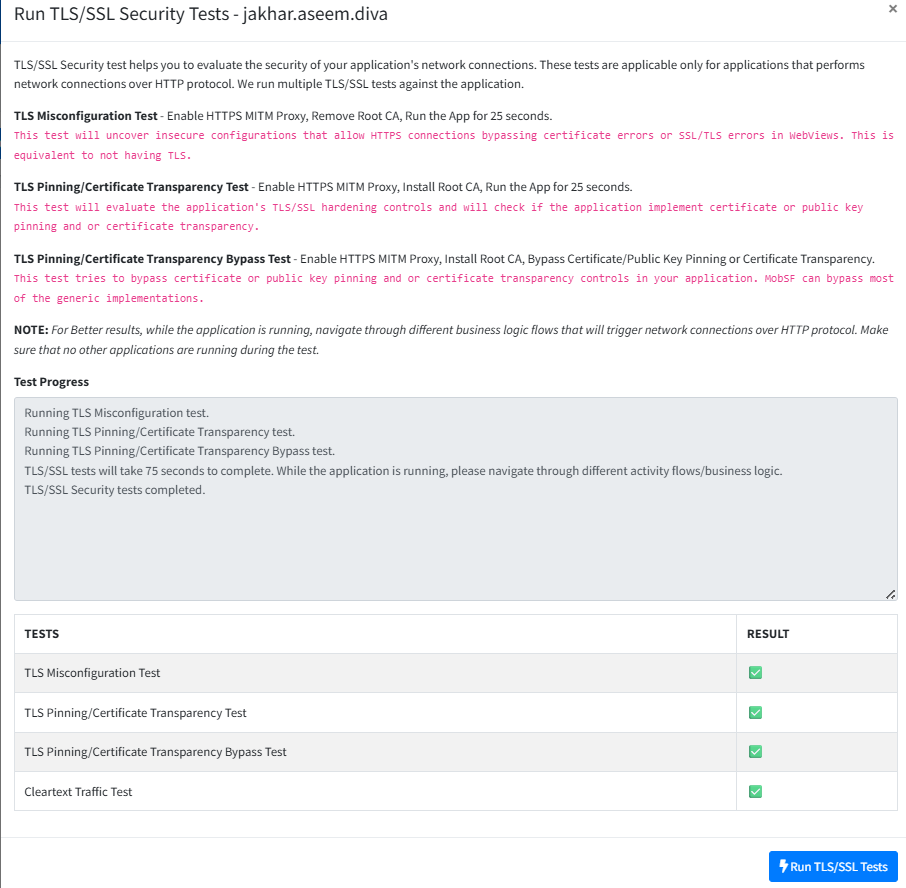

*Résultats : 4/4 tests interceptés — aucune protection réseau détectée dans DIVA*

---

## 8. Rapport dynamique final

**Objectif :** Générer et consulter le rapport d'analyse dynamique consolidé produit par MobSF.

**Qu'est-ce que le rapport dynamique MobSF ?**
À l'issue de l'analyse, MobSF consolide toutes les découvertes — activités exportées testées, trafic intercepté, logs Logcat, résultats TLS — en un rapport unifié consultable depuis l'interface web et exportable en PDF. Ce rapport constitue la trace officielle de l'analyse.

**Capture d'écran — Rapport dynamique final :**

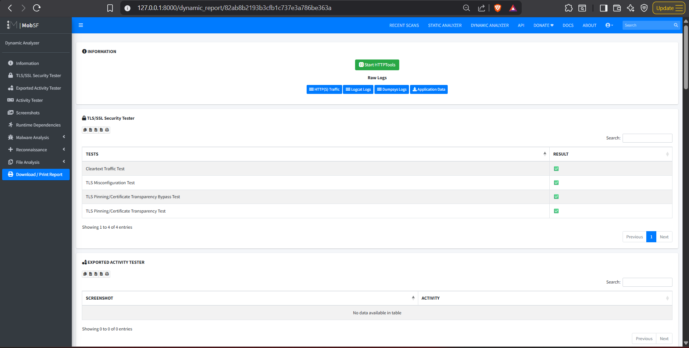
*Rapport dynamique final MobSF — synthèse complète de l'analyse avec toutes les découvertes consolidées*

---

## 9. Résumé exécutif

L'analyse de sécurité complète de `DivaApplication.apk` (package : `jakhar.aseem.diva`) a été conduite avec MobSF v4.5.0 couplé à un émulateur Android AVD API 30 dans un environnement Docker isolé. L'application analysée est **DIVA (Damn Insecure and Vulnerable App)**, une application intentionnellement vulnérable conçue à des fins pédagogiques.

Six vulnérabilités de sécurité ont été identifiées — trois évaluées à sévérité **Critique**, deux à sévérité **Élevée**, et une à sévérité **Moyenne** — couvrant la journalisation non sécurisée de données financières, le contrôle d'accès défaillant sur les composants Android, l'absence totale de protection TLS/SSL, une signature APK vulnérable à l'injection de code, un Content Provider non protégé et un SDK cible obsolète.

La découverte la plus critique est la journalisation en clair de numéros de carte bancaire dans les logs système (Logcat), combinée à l'exposition directe de credentials API via des activités exportées non protégées. L'absence de certificate pinning rend l'intégralité du trafic réseau interceptable par une attaque Man-in-the-Middle basique.

DIVA illustre de manière complète les **OWASP Top 10 Mobile** dans un contexte d'exploitation contrôlé et documenté.

**Niveau de risque global : 🔴 CRITIQUE**
*(Score MobSF : 35/100 — Multiple vulnérabilités critiques exploitables sans prérequis)*

---

## 10. Vulnérabilités confirmées

---

### 🔴 Vulnérabilité 1 — Journalisation Non Sécurisée de Données Sensibles

| Champ | Détail |
|-------|--------|
| **Sévérité** | CRITIQUE |
| **OWASP Mobile** | M2 — Insecure Data Storage |
| **CWE** | CWE-312 : Cleartext Storage of Sensitive Information |
| **Localisation** | `jakhar.aseem.diva.LogActivity` |
| **Preuve** | Numéros de carte bancaire visibles en clair dans le stream Logcat |

**Description :**
Le challenge "Insecure Logging" journalise les données saisies par l'utilisateur — y compris les numéros de carte bancaire — directement via `Log.d()` sans aucun filtrage ni masquage. Ces logs sont accessibles à toute application disposant de la permission système `READ_LOGS`.

**Impact réel :**
- Vol de données financières par une application tierce malveillante
- Aucun accès root requis
- Les logs persistent après fermeture de l'application

**Remédiation :**
Supprimer tous les appels `Log.d()`, `Log.e()`, `Log.i()` contenant des données utilisateur. Utiliser ProGuard/R8 en production pour retirer automatiquement les appels de log. Ne jamais logger de données sensibles, même en développement.

```java
// ❌ VULNÉRABLE
Log.d("DIVA", "Card Number: " + cardNumber);

// ✅ CORRECT
// Ne pas logger les données sensibles
```

---

### 🔴 Vulnérabilité 2 — Activités Exportées Sans Contrôle d'Accès

| Champ | Détail |
|-------|--------|
| **Sévérité** | CRITIQUE |
| **OWASP Mobile** | M1 — Improper Platform Usage |
| **CWE** | CWE-926 : Improper Export of Android Application Components |
| **Localisation** | `AndroidManifest.xml` — activités `APICreds` et `APICreds2` |
| **Preuve** | Activité `APICreds` lancée par MobSF sans authentification — accès accordé |

**Description :**
Deux activités exposant des credentials API (Tweeter API Credentials) sont exportées sans aucune protection de permission. N'importe quelle application tierce installée sur le même appareil peut lancer directement ces activités et afficher les credentials.

**Impact réel :**
- Accès non autorisé aux credentials API depuis n'importe quelle application tierce
- Aucune permission spéciale requise pour l'attaquant
- Exploitable via une simple intention Android : `startActivity(intent)`

**Remédiation :**
Ajouter `android:exported="false"` sur toutes les activités non destinées à être accessibles depuis l'extérieur. Si l'exportation est nécessaire, protéger avec une permission custom de niveau `signature`.

```xml
<!-- ❌ VULNÉRABLE -->
<activity android:name=".APICreds" android:exported="true"/>

<!-- ✅ CORRECT -->
<activity android:name=".APICreds" android:exported="false"/>
```

---

### 🔴 Vulnérabilité 3 — Absence de Protection TLS/SSL (Certificate Pinning)

| Champ | Détail |
|-------|--------|
| **Sévérité** | CRITIQUE |
| **OWASP Mobile** | M3 — Insecure Communication |
| **CWE** | CWE-295 : Improper Certificate Validation |
| **Localisation** | Configuration réseau globale de l'application |
| **Preuve** | 4/4 tests TLS/SSL interceptés avec succès par le proxy MobSF |

**Description :**
DIVA n'implémente aucun certificate pinning et accepte n'importe quel certificat présenté par un proxy intermédiaire. L'intégralité du trafic HTTPS peut être interceptée, lue et modifiée par un attaquant positionné sur le même réseau.

**Impact réel :**
- Interception complète du trafic HTTPS (attaque Man-in-the-Middle)
- Lecture et modification des données en transit
- Vol de tokens d'authentification, de credentials et de données personnelles

**Remédiation :**
Implémenter le certificate pinning via OkHttp ou la bibliothèque TrustKit. Activer un `network_security_config.xml` pour bloquer le trafic HTTP en clair.

```xml
<!-- res/xml/network_security_config.xml -->
<network-security-config>
    <domain-config cleartextTrafficPermitted="false">
        <domain includeSubdomains="true">api.example.com</domain>
        <pin-set>
            <pin digest="SHA-256">AAAAAAAAAAAAAAAAAAAAAAAAAAAAAAAAAAAAAAAAAAA=</pin>
        </pin-set>
    </domain-config>
</network-security-config>
```

---

### 🟠 Vulnérabilité 4 — Signature APK Incomplète (Vulnérable Janus)

| Champ | Détail |
|-------|--------|
| **Sévérité** | ÉLEVÉE |
| **OWASP Mobile** | M8 — Code Tampering |
| **CVE** | CVE-2017-13156 (Janus Attack) |
| **Localisation** | Signature de l'APK |
| **Preuve** | `v1 signature: True` / `v2 signature: False` / `v3 signature: False` |

**Description :**
L'APK est signé uniquement avec la signature v1 (JAR Signing). L'absence de signature v2/v3 expose l'application à l'attaque Janus qui permet d'injecter du bytecode DEX malveillant au début du fichier APK sans invalider la signature v1.

**Impact réel :**
- Injection de code malveillant dans l'APK sans détection par le système Android
- Distribution d'une version trojanisée de l'application semblant légitime
- Contournement de la vérification d'intégrité du package manager

**Remédiation :**
Migrer vers la signature APK v2/v3 (disponible depuis Android Studio). Toute build Gradle moderne génère v2/v3 par défaut.

---

### 🟠 Vulnérabilité 5 — Content Provider Exposé Sans Permission

| Champ | Détail |
|-------|--------|
| **Sévérité** | ÉLEVÉE |
| **OWASP Mobile** | M1 — Improper Platform Usage |
| **CWE** | CWE-200 : Exposure of Sensitive Information |
| **Localisation** | `AndroidManifest.xml` — Content Provider |
| **Preuve** | 1/1 Content Provider exporté sans permission de protection |

**Description :**
Le Content Provider de l'application est exporté sans aucune permission de protection, permettant à n'importe quelle application tierce d'accéder aux données internes de l'application via l'URI du provider.

**Impact réel :**
- Accès non autorisé aux données stockées par l'application
- Lecture, modification ou suppression potentielle de données sensibles

**Remédiation :**
Ajouter `android:permission` ou `android:readPermission` sur le Content Provider, ou le marquer `android:exported="false"` s'il n'est pas destiné à un accès externe.

---

### 🟡 Vulnérabilité 6 — SDK Minimum Obsolète

| Champ | Détail |
|-------|--------|
| **Sévérité** | MOYENNE |
| **OWASP Mobile** | M8 — Code Tampering |
| **CWE** | CWE-1104 : Use of Unmaintained Third Party Components |
| **Localisation** | `AndroidManifest.xml` |
| **Preuve** | `android:minSdkVersion="15"` — Android 4.0 (2011) |

**Description :**
L'application supporte Android 4.0 (API 15) sorti en 2011. Les appareils sous ces versions n'ont pas reçu de correctifs de sécurité depuis plus d'une décennie et ne bénéficient pas des protections modernes (SELinux renforcé, ASLR, SafetyNet).

**Remédiation :**
Élever `minSdkVersion` à 26 (Android 8.0) au minimum, ou idéalement 29 (Android 10).

---

## 11. Limitations techniques

### Incompatibilité Frida / Android API 30

**Erreur rencontrée :**
```
frida.NotSupportedError: unable to load libart.so
dlopen failed: library "libart.so" not found
```

**Cause :** Incompatibilité entre Frida Server v17.8.2 (dernière version disponible) et l'image Android API 30. La bibliothèque `libart.so` (Android Runtime) n'est pas localisée correctement par Frida dans cette configuration émulateur.

**Impact sur l'analyse :** Limité — les fonctionnalités de hook dynamique Java via Frida n'ont pas pu être démontrées. L'ensemble des autres fonctionnalités MobSF (Activity Tester, Logcat, Tests TLS/SSL, Rapport dynamique) ont fonctionné normalement.

**Solution recommandée :** Utiliser Frida v15.x ou v16.x, compatibles avec l'image Android API 30.

---

### Volume Docker et persistance des données

Cinq containers MobSF ont été créés lors de la session en raison de l'absence initiale de volume persistant. La commande corrigée avec volume nommé (voir Section 2) résout ce problème pour les sessions suivantes.

---

## 12. Recommandations priorisées

### Priorité 1 — Corriger immédiatement (avant tout déploiement)

**Supprimer les appels de log exposant des données sensibles**
Retirer tous les appels `Log.d/e/i()` contenant des numéros de carte, credentials, ou toute donnée utilisateur. Activer les règles ProGuard pour supprimer automatiquement les logs en build de release.

**Protéger les activités exportées**
Ajouter `android:exported="false"` sur toutes les activités non destinées à un accès externe. Pour les activités nécessitant une exposition, implémenter une permission custom de niveau `signature`.

**Implémenter le Certificate Pinning**
Intégrer OkHttp avec certificate pinning ou la bibliothèque TrustKit. Activer `network_security_config.xml` pour bloquer tout trafic HTTP en clair.

### Priorité 2 — Corriger avant la prochaine release

**Migrer vers la signature APK v2/v3**
Utiliser la signature multi-version dans la configuration Gradle pour éliminer la vulnérabilité Janus. Toute build Android Studio moderne gère cela automatiquement.

**Protéger le Content Provider**
Ajouter une permission de protection sur le Content Provider ou le marquer non-exporté si l'accès externe n'est pas requis.

### Priorité 3 — Planifier pour le prochain cycle de développement

**Élever le SDK minimum**
Mettre à jour `minSdkVersion` de 15 à 26 (Android 8.0) dans `build.gradle` pour garantir que tous les appareils supportés bénéficient des protections de sécurité modernes.

---

## 13. Fichiers produits

| Fichier | Contenu |
|---------|---------|
| `DivaApplication.apk` | APK analysé — application cible DIVA v1.0 |
| `Dynamic Analysis.pdf` | Rapport d'analyse dynamique complet exporté depuis MobSF |
| `images/` | 14 captures d'écran documentant chaque étape de l'analyse |

---

## 📸 Index des captures d'écran

| N° | Nom du fichier | Étape | Contenu |
|----|----------------|-------|---------|
| 1 | `images/1-docker_version.png` | Préparation | Docker Desktop v29.3.1 — version vérifiée |
| 2 | `images/2-avd_manager.png` | Préparation | AVD MobSF_DIVA_API_30 dans Android Studio Device Manager |
| 3 | `images/3-git_clone.png` | Préparation | Clonage du dépôt MobSF depuis GitHub |
| 4 | `images/4-start_avd.png` | Préparation | Lancement de l'émulateur via start_avd.ps1 |
| 5 | `images/5-adb_devices.png` | Préparation | Détection de l'émulateur (emulator-5554) via ADB |
| 6 | `images/6-docker_run.png` | MobSF | Dashboard MobSF opérationnel sur 127.0.0.1:8000 |
| 7 | `images/7-diva_security_score.png` | Analyse statique | Score de sécurité DIVA : 35/100 |
| 8 | `images/8-dynamic_analyzer_start.png` | Analyse dynamique | Interface Dynamic Analyzer avec Frida actif |
| 9 | `images/9-exported_activity.png` | Activités | Activité APICreds ouverte sans authentification |
| 10 | `images/10-diva_challenges.png` | Activités | Les 13 challenges DIVA sur l'émulateur |
| 11 | `images/11-logcat_stream.png` | Logcat | Logs runtime avec données sensibles en clair |
| 12 | `images/12-tls_ssl_tests.png` | TLS/SSL | Interface des 4 tests TLS/SSL MobSF |
| 13 | `images/13-tls_ssl_results.png` | TLS/SSL | Résultats : 4/4 tests TLS interceptés |
| 14 | `images/14-dynamic_report.png` | Rapport | Rapport dynamique final généré par MobSF |

---

*Rapport produit dans le cadre du LAB 7 — Analyse Dynamique d'un APK avec MobSF*
*Cours : Sécurité des applications mobiles | Plateforme MLIAEdu*
*Analyste : Amine Floulou
